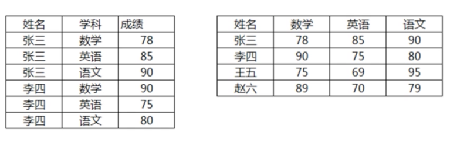
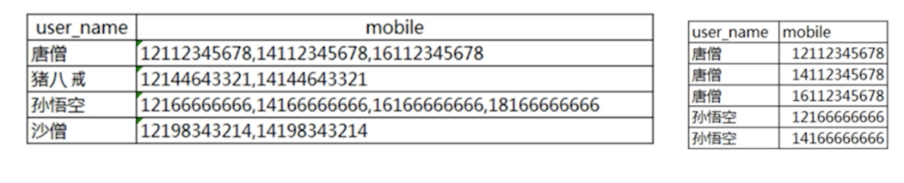
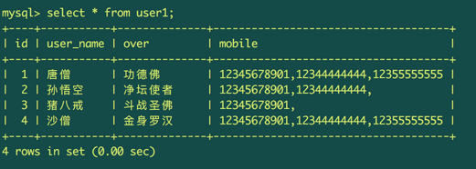
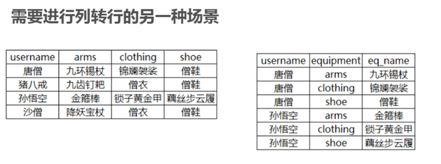

# 行和列互转的SQL技巧

## 1. 行转列的场景




### 1-1：使用自连接方式实现行转列


user1 表结构：

```
mysql> select * from user1;
+----+-----------+--------------+
| id | user_name | over         |
+----+-----------+--------------+
|  1 | 唐僧      | 功德佛       |
|  2 | 孙悟空    | 净坛使者     |
|  3 | 猪八戒    | 斗战圣佛     |
|  4 | 沙僧      | 金身罗汉     |
+----+-----------+--------------+
4 rows in set (0.00 sec)
```

kills表结构：

```
mysql> select * from kills;
+----+---------+-------+
| id | user_id | kills |
+----+---------+-------+
|  1 |       2 |    12 |
|  2 |       2 |    23 |
|  3 |       1 |     9 |
|  4 |       3 |    22 |
|  5 |       2 |    44 |
|  6 |       3 |    33 |
|  7 |       1 |    11 |
|  8 |       1 |    44 |
|  9 |       1 |    55 |
| 10 |       4 |     2 |
+----+---------+-------+
10 rows in set (0.00 sec)

```

将user1 和 kills进行内连接并分组

```
mysql> select a.user_name, sum(k.kills) from user1 a join kills k on  a.id=k.user_id group by a.user_name;
+-----------+--------------+
| user_name | sum(k.kills) |
+-----------+--------------+
| 唐僧      |          119 |
| 孙悟空    |           79 |
| 沙僧      |            2 |
| 猪八戒    |           55 |
+-----------+--------------+
4 rows in set (0.00 sec)
```

使用交叉连接实现行转列

```
select * from

(select sum(k.kills) as '猪八戒' from user1 a inner join kills k on a.id=k.user_id and a.user_name='猪八戒') a

cross join

(select sum(k.kills) as '唐僧' from user1 a inner join kills k on a.id = k.user_id and a.user_name='唐僧') b

cross join

(select sum(k.kills) as '沙僧' from user1 a inner join kills k on a.id = k.user_id and a.user_name='沙僧') c

cross join

(select sum(k.kills) as '孙悟空' from user1 a inner join kills k on a.id = k.user_id and a.user_name='孙悟空') d;

+-----------+--------+--------+-----------+
| 猪八戒    | 唐僧   | 沙僧   | 孙悟空    |
+-----------+--------+--------+-----------+
|        55 |    119 |      2 |        79 |
+-----------+--------+--------+-----------+
1 row in set (0.00 sec)

```
### 1-2：使用case语句实现行转列


```
select
sum(case when user_name='孙悟空' then kills end) as '孙悟空',
sum(case when user_name='孙悟空' then kills end) as '孙悟空',
sum(case when user_name='孙悟空' then kills end) as '孙悟空',
sum(case when user_name='孙悟空' then kills end) as '孙悟空'
from user1 a join kills k on a.id=k.user_id;

+-----------+-----------+-----------+-----------+
| 孙悟空    | 孙悟空    | 孙悟空    | 孙悟空    |
+-----------+-----------+-----------+-----------+
|        79 |        79 |        79 |        79 |
+-----------+-----------+-----------+-----------+
1 row in set (0.00 sec)

```

## 2.单列转多行

### 2-1：使用场景




### 2-2：使用序列化表的方法实现列转行



将user1中的数据的mobile列进行转行

- 第一步：创建一个序列化表：

```
mysql> create table  tb_sequence(id int primary key auto_increment not null);
Query OK, 0 rows affected (0.01 sec)

mysql> insert into tb_sequence values(),(),(),(),(),(),(),(),();
Query OK, 9 rows affected (0.00 sec)
Records: 9  Duplicates: 0  Warnings: 0

mysql> select * from tb_sequence;
+----+
| id |
+----+
|  1 |
|  2 |
|  3 |
|  4 |
|  5 |
|  6 |
|  7 |
|  8 |
|  9 |
+----+
```

- 第二步：利用序列化表将列转为多行

```
select
user_name,
replace(substring(substring_index(mobile,',', a.id), char_length(substring_index(mobile, ',', a.id -1))+1), ',', '') as mobile

from tb_sequence a
cross join
(
  select user_name,
  concat(mobile, ',') as mobile,
  length(mobile) - length(replace(mobile, ',',''))+1 size
  from user1 b
) b

on a.id <=b.size;


+-----------+-------------+
| user_name | mobile      |
+-----------+-------------+
| 唐僧      | 12345678901 |
| 唐僧      | 12344444444 |
| 唐僧      | 12355555555 |
| 孙悟空    | 12345678901 |
| 孙悟空    | 12344444444 |
| 孙悟空    |             |
| 猪八戒    | 12345678901 |
| 猪八戒    |             |
| 沙僧      | 12345678901 |
| 沙僧      | 12344444444 |
| 沙僧      | 12355555555 |
+-----------+-------------+
11 rows in set (0.00 sec)
```


## 3. 多列转多行

### 3-1：场景



### 3-2：使用union all 多列转多行的实例


```
select user_name, 'arms' as equipment, arms from user1 a

join equipment b on a.id = b.user_id

union all

select user_name, 'clothing' as equipment, arms from user1 a

join equipment b on a.id = b.user_id

union all

select user_name, 'shoe' as equipment, arms from user1 a

join equipment b on a.id = b.user_id

order by user_name;

+-----------+-----------+--------------+
| user_name | equipment | arms         |
+-----------+-----------+--------------+
| 唐僧      | shoe      | 九环锡杖     |
| 唐僧      | clothing  | 九环锡杖     |
| 唐僧      | arms      | 九环锡杖     |
| 孙悟空    | clothing  | 九池钉靶     |
| 孙悟空    | arms      | 九池钉靶     |
| 孙悟空    | shoe      | 九池钉靶     |
| 沙僧      | shoe      | 降妖报账     |
| 沙僧      | clothing  | 降妖报账     |
| 沙僧      | arms      | 降妖报账     |
| 猪八戒    | shoe      | 紧箍咒       |
| 猪八戒    | clothing  | 紧箍咒       |
| 猪八戒    | arms      | 紧箍咒       |
+-----------+-----------+--------------+
12 rows in set (0.00 sec)

```
