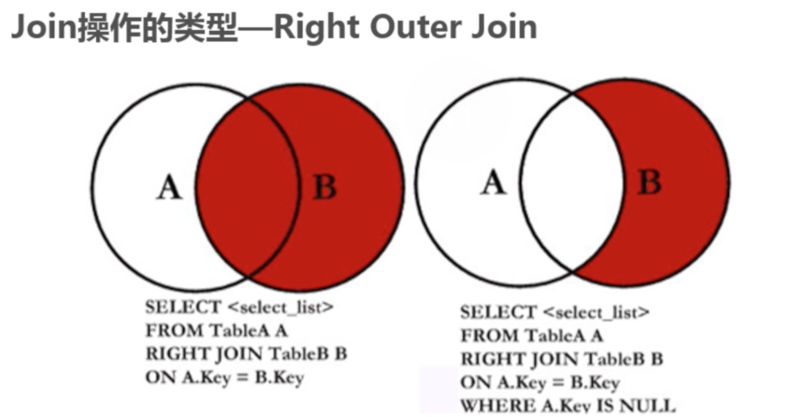
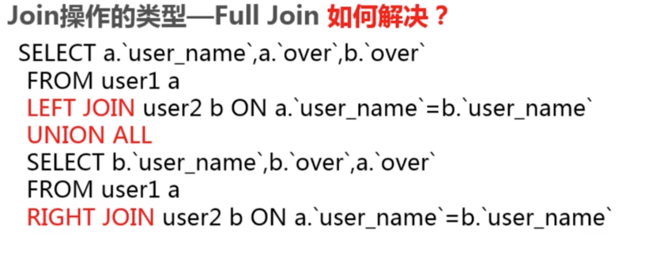

# 正确使用join从句


## 1. SQL标准中Join的类型


## 2. Inner Join(内连接)

### 2-1: 什么inner join？


### 2-2: 实例演示

```
select a.user_name, a.over, b.over from user1 a
inner join user2 b on a.user_name = b.user_name;

```

## 3. Left Outer Join(左外连接)

### 3-1: 什么左外连接


###  3-2: 实例演示

```
# 查询出user1表中的信息，如果user2在user1中没有，以NULL的显示。

select a.user_name, a.over, b.over from user1 a
left join user2 b on a.user_name = b.user_name;


# 查询出user1表的信息，以及user2在user1中有的
select a.user_name, a.over, b.over from user1 a
left join user2 b on a.user_name = b.user_name
where b.user_name IS NOT NULL;

```


## 4. Right Outer join (右外连接)

### 4-1：什么是右外连接





## 5. Full join 全连接

### 5-1： 什么是全连接


### 5-2：Full join 带来的问题


### 5-3： union all合并解决问题




## 6.Cross Join(交叉连接)

### 6-1：什么交叉连接


### 6-2：交叉连接实现


