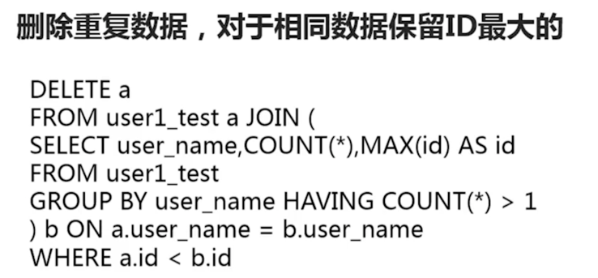
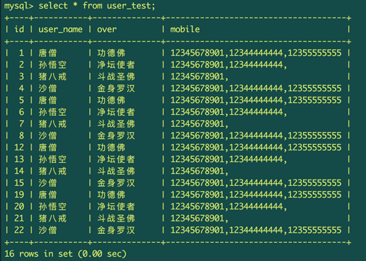

# 利用主键删除重复数据

## 1. 删除重复数据

### 1-1：删除策略



### 1-2： 删除实现




将表中的重复数据删除

```
mysql> select user_name, count(*), max(id) as id from user_test group by user_name having count(*) > 1;
+-----------+----------+------+
| user_name | count(*) | id   |
+-----------+----------+------+
| 唐僧      |        4 |   19 |
| 孙悟空    |        4 |   20 |
| 沙僧      |        4 |   22 |
| 猪八戒    |        4 |   21 |
+-----------+----------+------+
4 rows in set (0.00 sec)

mysql> delete a from user_test a

join

(select user_name, count(*), max(id) as id from user_test group by user_name having count(*) > 1)  b

on

a.user_name = b.user_name where a.id < b.id;

Query OK, 12 rows affected (0.01 sec)

mysql> select id,user_name,over from user_test;
+----+-----------+--------------+
| id | user_name | over         |
+----+-----------+--------------+
| 19 | 唐僧      | 功德佛       |
| 20 | 孙悟空    | 净坛使者     |
| 21 | 猪八戒    | 斗战圣佛     |
| 22 | 沙僧      | 金身罗汉     |
+----+-----------+--------------+

```
