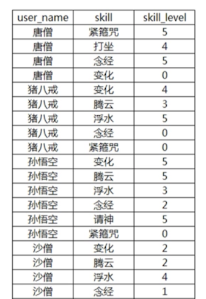
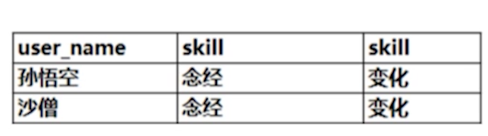

# 同一属性的多值多虑

## 1. 定义

> 对同一个字段，进行多值的查询过滤

请查看一下表结构：



接下来，我们针对以上的表结构的 skill属性，进行多值过滤。

## 2. 需求

根据以上的技能表，看如下需求：

需求： 如何查询出同时具有 `变化` 和 `念经`这两项技能的取经人？





## 3. 实例

### 3.1 使用join实现


```
mysql> select a.user_name, b.skill, c.skill from user1 a

join user1_skill b on a.id=b.user_id

join user1_skill c on c.user_id = b.user_id

where b.skill = '念经' and c.skill = '变化';

+-----------+--------+--------+
| user_name | skill  | skill  |
+-----------+--------+--------+
| 唐僧      | 念经   | 变化   |
| 孙悟空    | 念经   | 变化   |
| 猪八戒    | 念经   | 变化   |
+-----------+--------+--------+
3 rows in set (0.00 sec)

```
