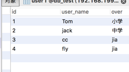
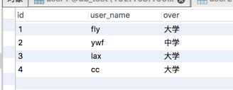
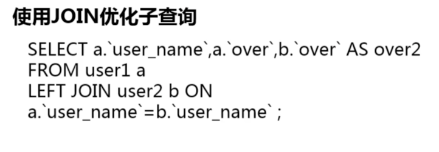
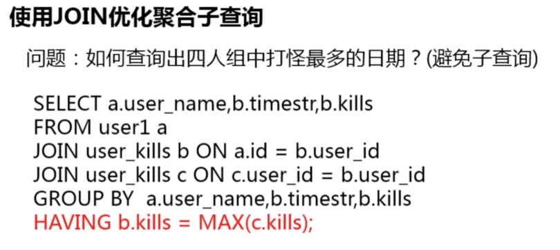
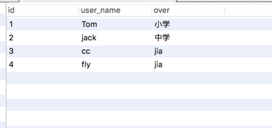

# 使用join更新表
## 1. 使用join更新表
user1表：

   

user2表



### 1-1： 演示

> 需求：更新user1表中，user_name 在user1表中和user2表中同时存在的over字段
>
> 实现思路：
>
> 1. 内连接查询user1和user2表中user_name 相同的数据
> 2. 使用join 将 步骤1 查询的数据，进行内连接，来更新user1表。

```
update user1 a join (select b.user_name from user1 a join user2 b  

on a.user_name=b.user_name) b on a.user_name=b.user_name set

a.over='家';

```

## 2. 使用join优化子查询

### 2-1：实例




## 3. 使用join优化子聚合子查询

### 3-1：实例说明



## 4. 使用join实现分组选择数据

user1表



kills表


> 需求：
>
> 结合user1和kills表，查询user1表中的user_name ,
>
> 在kills表中对应的kills数量排行前两名的数据显示出来


```
mysql> select d.user_name, c.kills from

(select user_id, kills, (select count(*) from kills b where

b.user_id=a.user_id and a.kills <= b.kills) as count from kills a  

group by user_id, kills) c

join user1 d on c.user_id=d.id where count<=2;

+-----------+-------+
| user_name | kills |
+-----------+-------+
| Tom       |    55 |
| Tom       |    44 |
| jack      |    44 |
| jack      |    23 |
| cc        |    33 |
| cc        |    22 |
| fly       |     2 |
+-----------+-------+
7 rows in set (0.00 sec)
```
