##1. count()和 max()的函数优化

### 1-1:max()函数优化

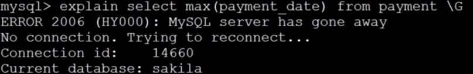

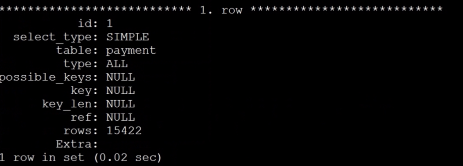

> 在查询过程中，我们发现sql执行计划中，type=all 使用了表扫描的操作。
>
> 没有使用到索引。

如何优化？

需要在max()函数中的关键字段，创建索引。

查看添加索引之后的sql查询计划

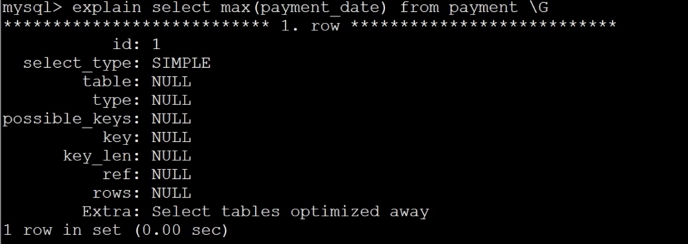

### 1-2.count()函数的优化

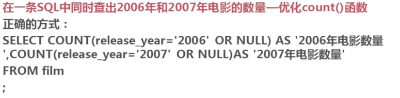

#### 2.1： count(*) 和 count(cloumn)区别：

          count(*): 会统计出值为空行
          count(cloumn)： 过滤到值为空的行

## 2. 子查询优化

### 2-1:子查询优化

子查询优化，通常情况下，优化为join查询。

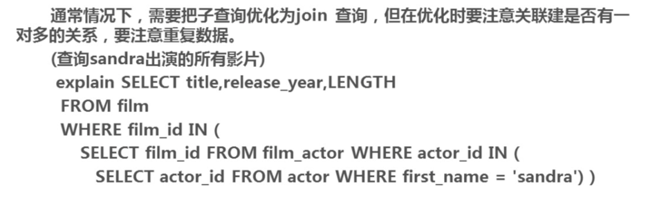

### 2-2: 实例演示

优化前：

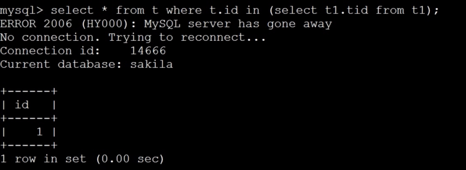

优化后：

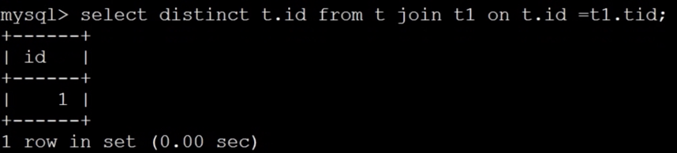

`注意`： 使用distinct关键字去重复

## 3.优化group by查询

### 3.1 优化前的sql

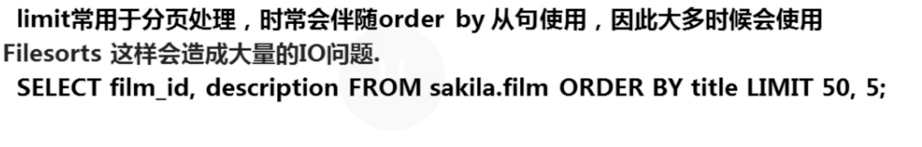

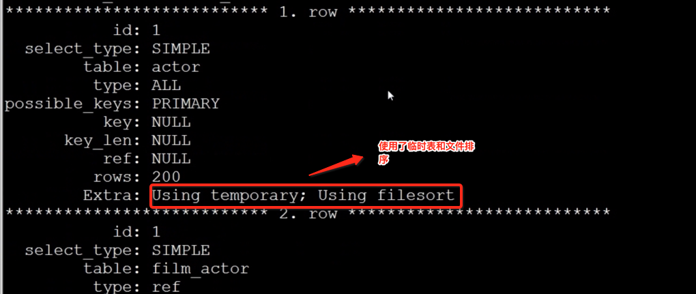

`在关联查询中，使用group by的缺陷：`

> 在查询过程，会创建一个关联的临时表和文件排序的方式进行查询的。

### 3.2 优化后的sql

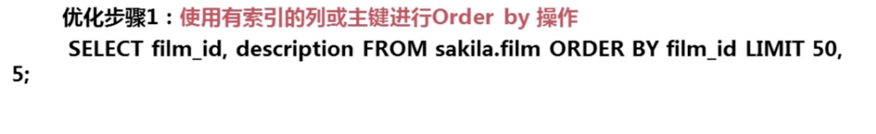

## 4. limit 查询优化

### 4-1: 优化前的sql

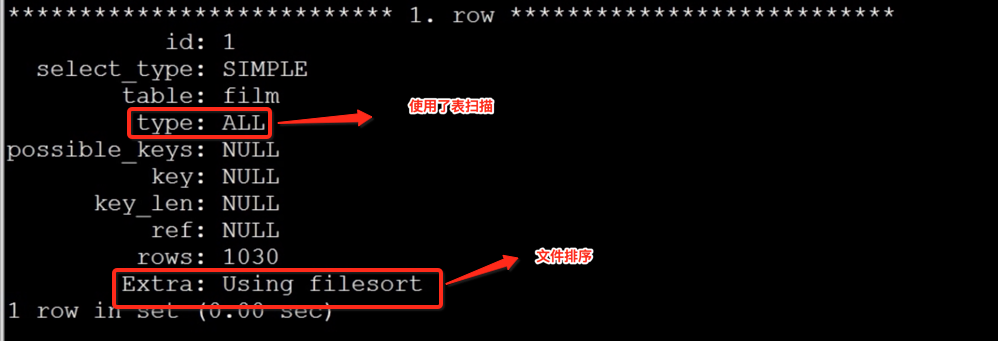

### 4-2: 优化后的sql

使用索引或者主键进行order by操作：

优化之后的查询计划：

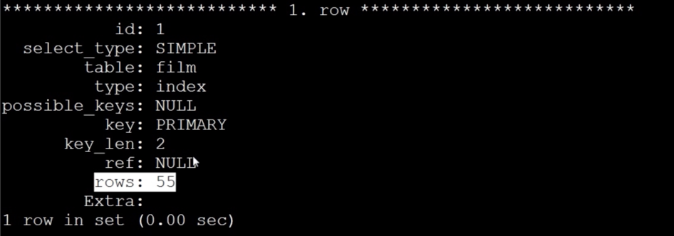
