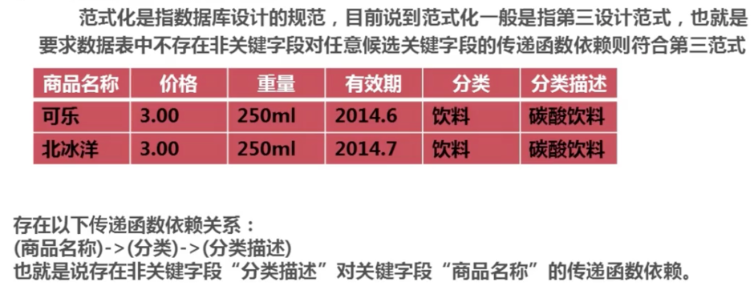
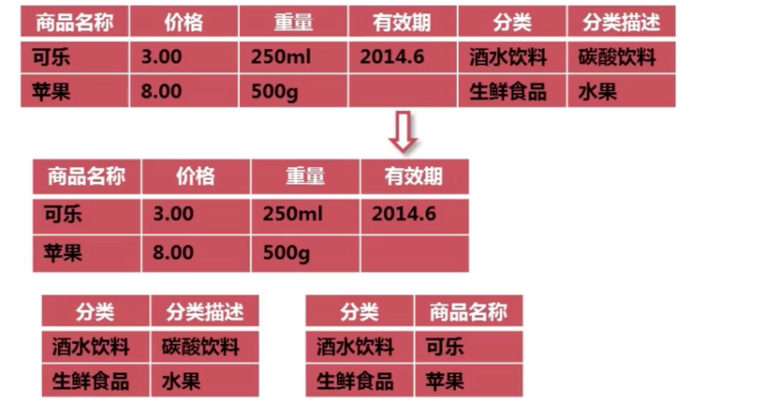
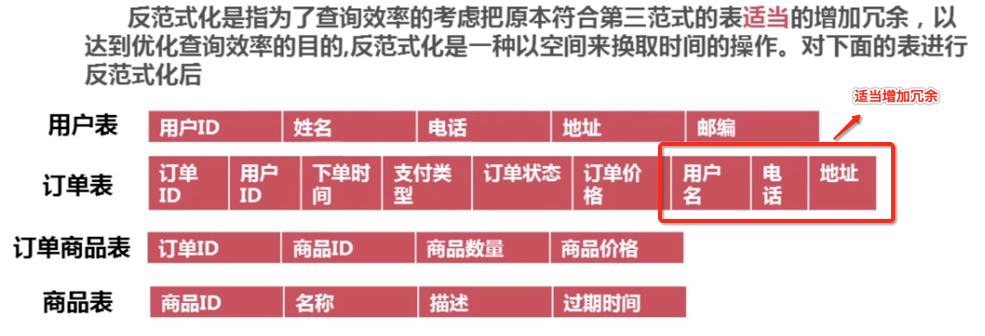
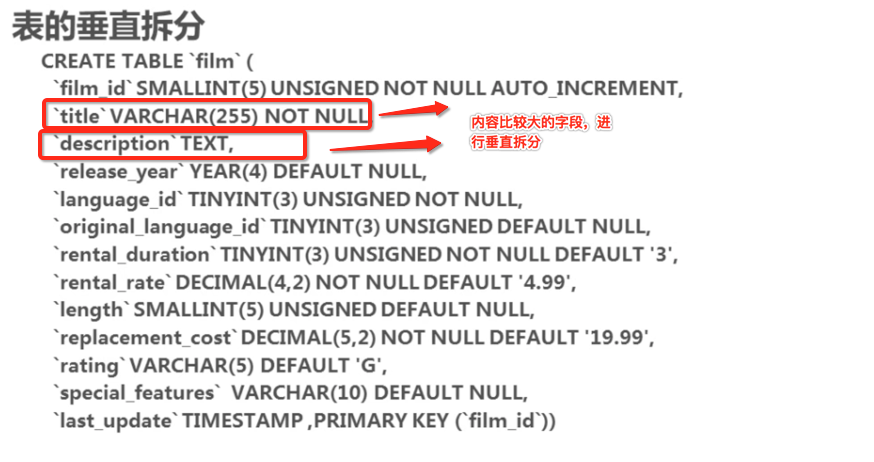
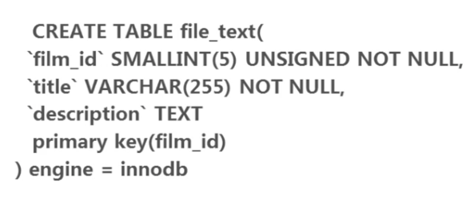

## 1. 表的范式优化

### 1.1 了解表的第三范式

### 1.2 标准的表的第三范式

### 1.3 范式表的优点和缺陷

> 优点： 减少表的字段冗余
> 缺陷：由于会建立多个关联表，会影响查询效率。

## 2. 表的反范式优化

### 2.1 什么是反范式？

## 3， 表的垂直拆分

### 3.1 表的垂直拆分遵循的规则

### 3.2 实例

将title, description 拆分成一个表

