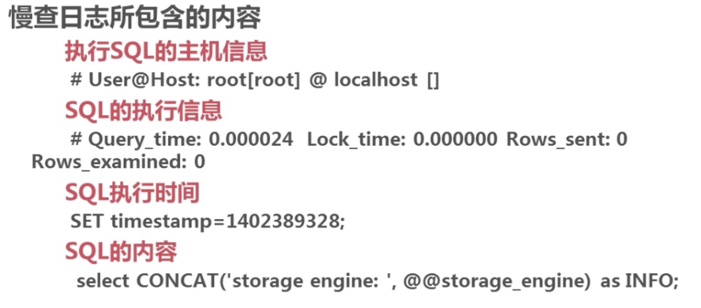
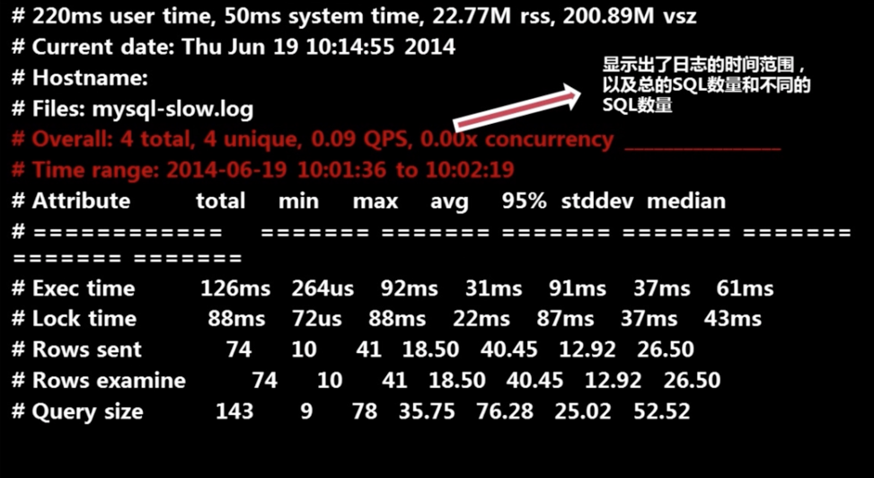
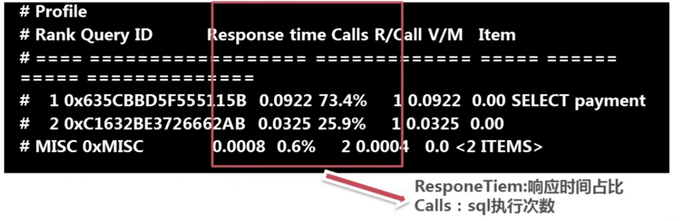
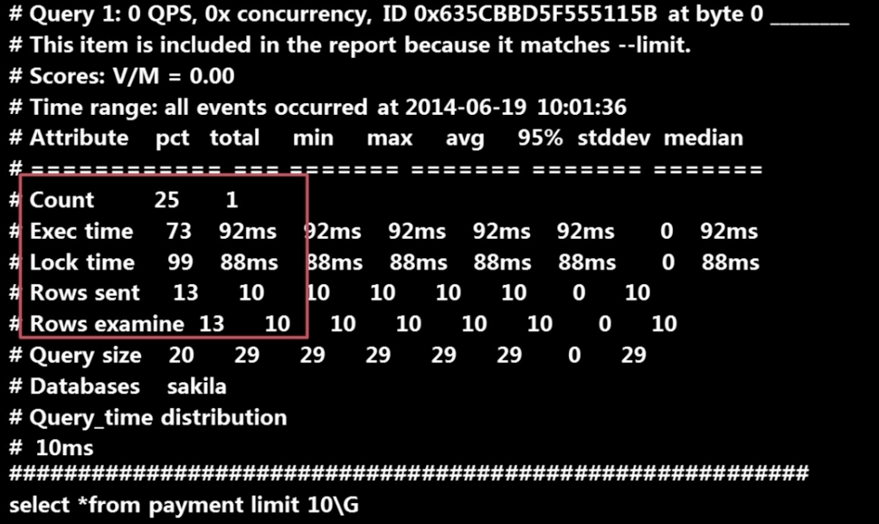
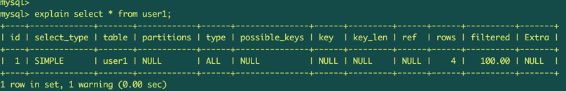
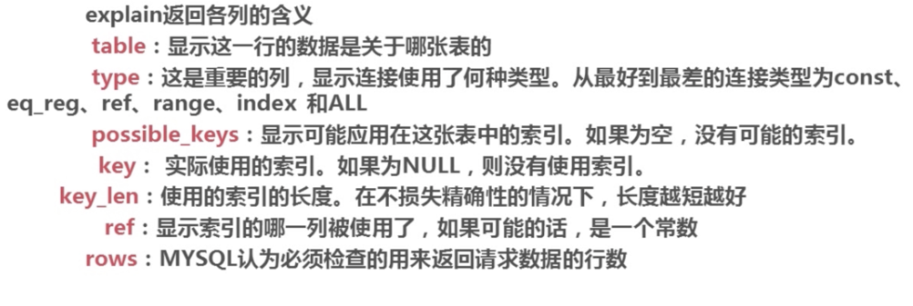

# 1. 慢查询日志分析

## 1 开启慢查询日志

### 1.1 参数说明：


开启慢查询日志相关参数说明：

>1. slow_query_log 启动停止记录慢查日志
> 2.show_query_log_file  指定慢查日志的存储路径及文件
> 3. long_query_time 指定记录慢查日志sql执行时间的阈值
> 4. log_queries_not_using_indexes 是否记录未使用索引sql  on 开启  off 关闭


### 1.2：演示

```

# 查看系统变量slow_query_log 开启情况.默认未开启
mysql> show variables like 'slow_query_log';
+----------------+-------+
| Variable_name  | Value |
+----------------+-------+
| slow_query_log | OFF   |
+----------------+-------+
1 row in set (0.00 sec)

mysql> set global slow_query_log=on;
Query OK, 0 rows affected (0.00 sec)

mysql> set global log_queries_not_using_indexes=on;
Query OK, 0 rows affected (0.00 sec)

mysql> set global long_query_time=0.01;
Query OK, 0 rows affected (0.00 sec)

mysql> set global slow_query_log_file='/var/lib/mysql/mysql-slow.log';
Query OK, 0 rows affected (0.00 sec)


# 查看变量设置情况
mysql> show variables like 'slow%';
+---------------------+-------------------------------+
| Variable_name       | Value                         |
+---------------------+-------------------------------+
| slow_launch_time    | 2                             |
| slow_query_log      | ON                            |
| slow_query_log_file | /var/lib/mysql/mysql-slow.log |
+---------------------+-------------------------------+
3 rows in set (0.00 sec)


```


### 1.3 慢查询日志格式：



## 2. pt-query-digest 慢查询工具使用

### 2.1 参数说明

- pt-query-digest slow-log :
- pt-query-digest slow-log
h=127.0.0.1,
D=db_test,
p=ywf,
P=3306,
u=root,
t=query_review
--create-reviewtable
--review-history t=hostname_slow


### 2.2 实例

- 安装工具

        sudo apt install percona-toolkit

- 使用

```
ywf@ywf-VirtualBox:~$ pt-query-digest /home/ywf/mysql/slow-log.log | more;


```

- 输出格式说明










- 发现慢查询有问题的sql


- 分析mysql查询计划

explain命令，查看查询计划。

如：





explain命令返回结果说明

 
